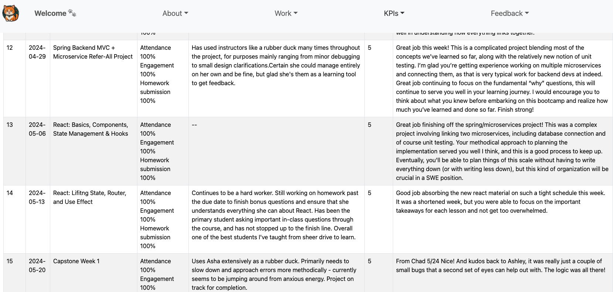
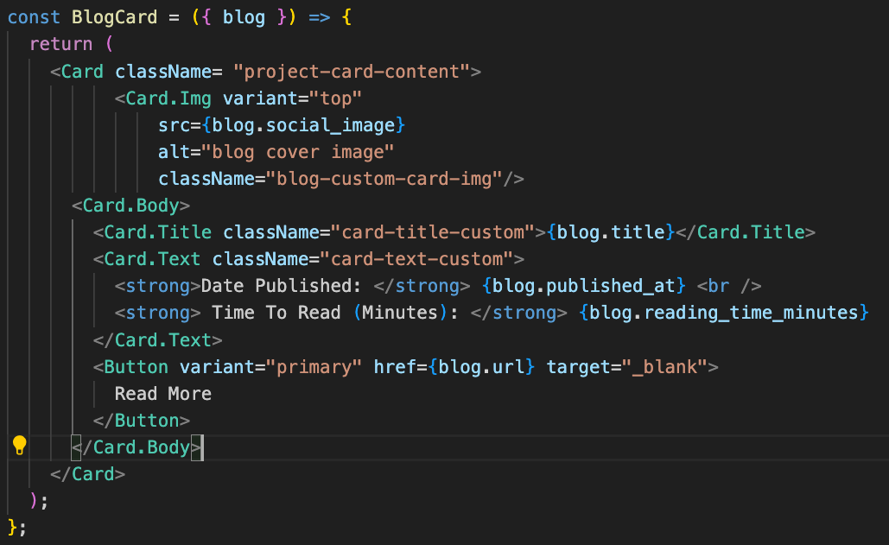
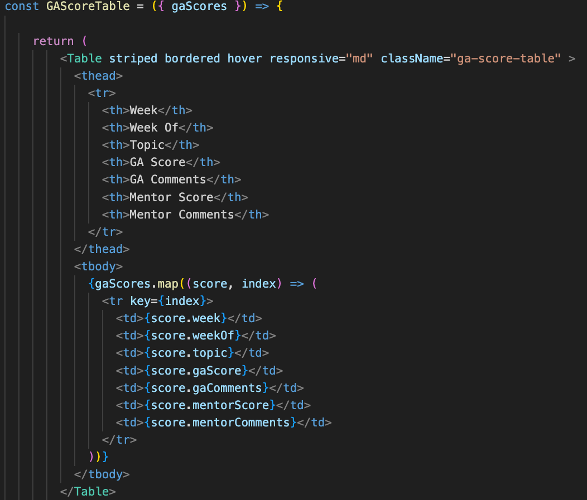
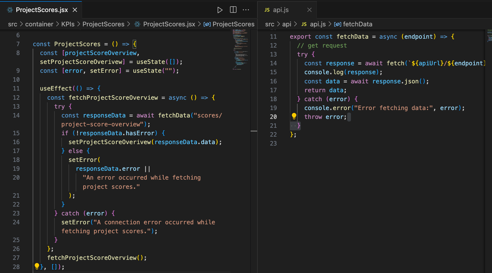
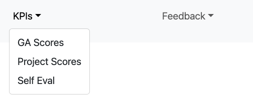
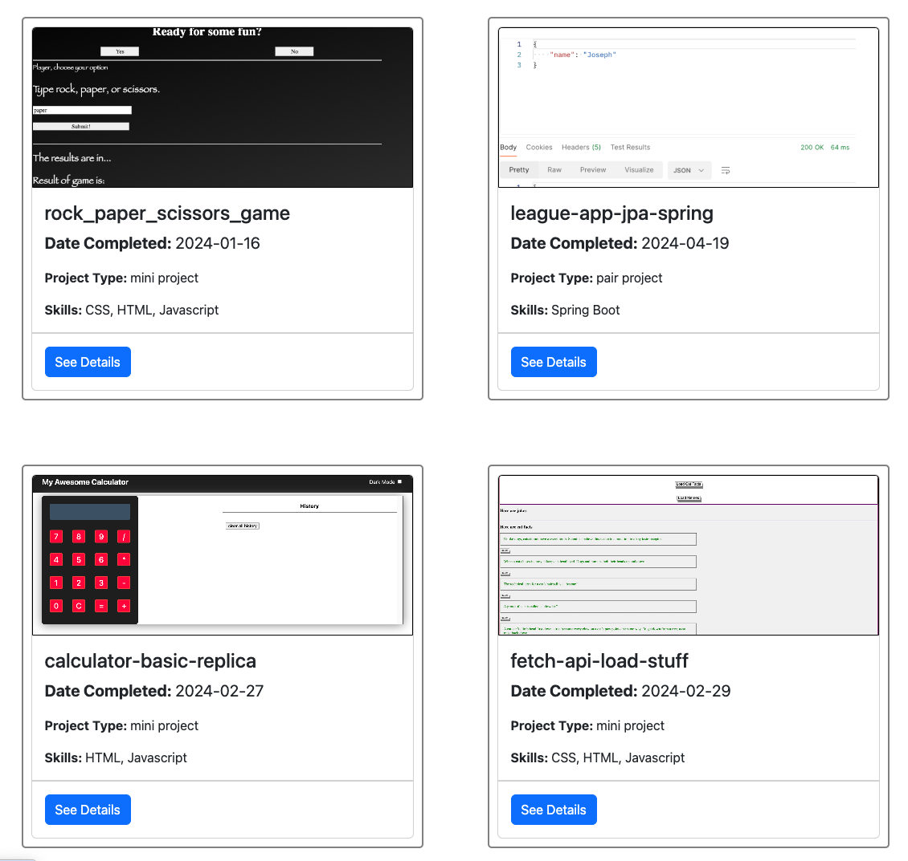
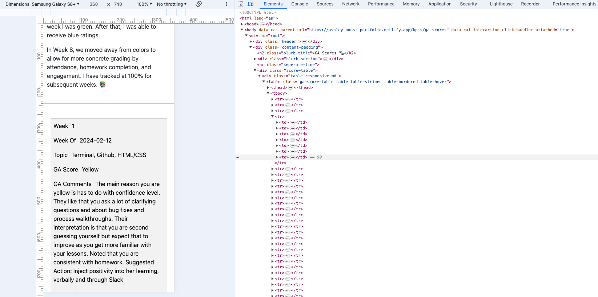
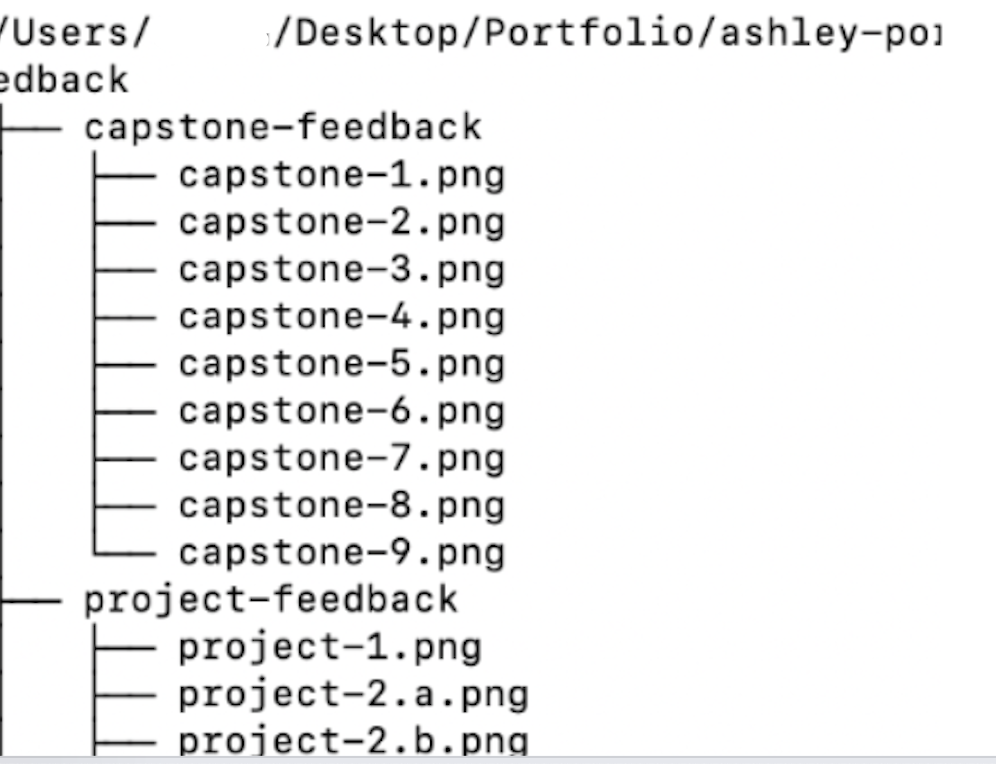
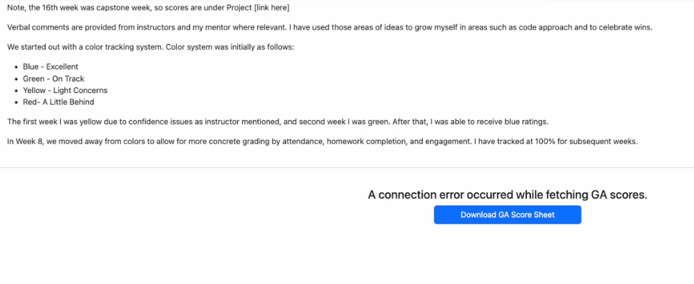

# My Portfolio Frontend
---
# Intro

This portfolio was started in my 18th week of coding, 2 weeks after the conclusion of our 16-week bootcamp. The repo here contains the frontend codebase, using React, CSS, and Javascript. As of July 2024, this repo is hosted on Netlify. https://ashley-boost-portfolio.netlify.app/ 

---
# Overview
## Purpose
Given my interest in both frontend and backend- as they each respectively appeal to my creative and technical deep-dive side, I decided to make my portfolio fullstack. This portfolio is used to document my metrics through my General Assembly (GA) bootcamp journey, as well as projects and more.  

## Features 
The frontend renders fetch API calls from the backend to display my project details,  GA scores, project scores, and more. Additionally, my frontend maps over arrays of feedback images, and calls the Forem API to display my dev.to blogs , etc. Finally, my frontend showcases information about me including my hobbies, experience, and more.  



## Installation
When cloning the project for use- make sure to run `npm i` to install required React dependencies on your local machine. Also, you will want to run the following two lines, as my portfolio app uses react-router and react bootstrap:

```
npm install react-router-dom
npm install react-bootstrap bootstrap
```
## Credits
Part of learning as one of our mentors Leo put is finding reference code as well so you don’t have to reinvent the wheel. I wanted to wholeheartedly and humbly give credit to these two individuals, and I was able to learn too from their tutorial posts! :) 
- Credit to [Tia Eastwood](https://dev.to/tiaeastwood/how-to-use-the-forem-api-to-display-your-devto-blog-posts-on-your-website-easy-3dl3) for her awesome reference code to call Dev.To’s API.
 - Credit to [Chris Coyer]( https://css-tricks.com/responsive-data-tables) for his superstar reference code on making tables mobile responsive. 
---

# Table of Contents

1. [Code Structure](#code-structure)
   - [Rendering Data](#rendering-data)
   - [Utilities](#utilities)
     - [Api.js](#apijs)
     - [Image Arrays](#image-arrays)
   - [Image Mapping](#image-mapping)
   - [Design](#design)
   - [Padding](#padding)
   - [NavBar](#navbar)
   - [Card Images](#card-images)
   - [Responsive Table](#responsive-table)
     - [Pseudo-elements](#pseudo-elements)
   - [File Set-Up](#file-set-up)
     - [Image Hosting](#image-hosting)
     - [Bash Bulk Rename](#bash-bulk-rename)
     - [Bash File Path](#bash-file-path)
   - [Downloadable Files](#downloadable-files)
2. [Functionality](#functionality)
   - [useParams](#useparams)
   - [VS. Variable Reroute](#vs-variable-reroute)
   - [Conditional Navigation](#conditional-navigation)
3. [Error Handling](#error-handling)
4. [Environment Variables](#environment-variables)
   - [Database Integrity](#database-integrity)
   - [API Security](#api-security)
---
# Code Structure
## Rendering Data 
To maintain separation of concern, I use containers to make the API calls to my backend endpoints defined [here](https://github.com/ashleyd480/ashley-portfolio-backend). The containers’ response data are mapped over components; respectively containers help to handle the logic and data, while components help to render the presentation. 

For example, my container `DevBlog.jsx` makes the call to Forem API- which is used to fetch and display my  blog posts from the dev.to platform. Then, these posts are mapped over a Card component called `BlogCard.jsx`. You can see how the response data referred to `blog` is passed as a prop to this component, and then, the data fields are mapped to their respective headers. For example, `blog.title` is rendered as the Card title. 

Likewise, my containers where I make the calls to `get` the bootcamp and assorted project scores call on their respective components that render that response data to tables. In the screenshot below of a GA Score component, you can see how after I define the `th` (table headers) with the column names- then the response data of bootcamp scores are mapped over `tr` (table rows) and for each row, each record in the bootcamp score is respectively rendered in its respective cell `td`. 


## Utilities 

### Api.js
To keep my code DRY, `api.js` is a Javascript file in my utilities folder with the `get mapping` call. The `fetchData` in that file contains the repetitive logic of making `get requests` and parsing Json requests through `await response.json()`.


### Image Arrays 
Also within my utilities package are the screenshots of feedback I received, by category. The images are saved as a variable of type array, and within each element of the array- is an object with key-value pairs of the image category, src, and alt for accessibility. These images are imported with a relative path to the assets folder as variables. 
Note: We had to use variables to represent the images, as using the relative path in the src presented issues when rendering these images on another component. Think of it like navigating to a friend’s home- if you just say “go 10 steps east” - that direction may change depending on where you stand. However, if you use a variable to represent the image, that is the equivalent of giving directions as a “latitude and longitude”- so that no matter where you are- you can find it (it being the image in this case)

## Image Mapping
These images from the image arrays are called or filtered where necessary in their respective page container. For example, in `Adhoc.jsx` the feedback images are split into peer and team feedback.
You can see how  (image) => image.imageCategory === "peer-feedback" is an anonymous arrow function that checks to see if each image in the array has a category of `peer-filter` and if so adds it to the `peerFeedbackImages` array.
```
const Adhoc = () => {
  const peerFeedbackImages = adhocFeedback.filter(
    (image) => image.imageCategory === "peer-feedback"
  );
```
This return of images is then mapped over the `ImageMap` component. :  ` <ImageMap images={peerFeedbackImages} />` The images prop is passed along.

Then in `ImageMap.jsx`- that is how the images are mapped over- with each image contained in a div, and the image.src and image.alt attributes are rendered to display the images. 
```
const ImageMap = ({ images }) => {
    return (
      <div className="feedback-image-container blurb-section">
        {images.map((image, index) => (
          <div key={index}>
            
          </div>
        ))}
      </div>
    );
  };
```
Note: i chose to enclose each image in a div to allow for more flexible formatting features. You can see how in the CSS below, I’m able to format each image div, so that the images can move responsively. That is as the screen gets wider, more images can fit on the page with the ` flex: 1 1 calc(50% - 20px)`, which allows each image div to take up 50% of container width minus the gap.


```
  .feedback-image-container > div {
    flex: 1 1 calc(50% - 20px);     display: flex;
   align-items: center; 
   height: 100%; /* Ensures each image wrapper stretches to align items at the bottom */

   /* justify-content: center; */
  }
```
---
# Design
My portfolio is designed with a clean CSS to avoid sensory overload to users. Also, to further separate the pages, my NavBar uses NavDropdowns- with the title being the main category (i.e. KPIs) and the NavDropdown.Item being the pages under that category such as “GA scores” and “Project Scores.” This lets the reader explore about me in a less-overwhelming way by having the separation of concern between information about me.



## Padding
To help space things apart visually, I put padding around all my pages- and did this by adding a div with a className of `content-padding` (a style which I then defined in `App.css`) for each of my pages on app.jsx. In other words, this helps to  apply the padding to each page rendered by the Routes component.
```
const App = () => {
  return (
   
    <>
      <Header />
      <div className="content-padding">

      <Routes>
        <>
```
This padding also helps so that the nav bar doesn’t overlap with the content when it’s sticky on top of the page on the desktop.

Further to add spacing before a URL, I used the `{“ ”}` syntax to ensure that the preceding word before a link is not jammed together with the link, ensuring a flow of text that is reader-friendly.

```
        read more about this program {" "}
          <a
         href="https://dev.to/trusted-member"
         target="_blank"
         rel="noopener noreferrer"
       >
         here
       </a>

```

## NavBar
I wanted the NavBar to be easily accessible, so that even on longer pages, the navigation bar would be at the top so users could easily navigate on to other pages without having to scroll all the way back up. This would be especially essential on Desktop.  

- For smaller screens- the formatting was set to `.fixed-top { position: static !important; }`
This ensures that the navbar behaves like a normal element and scrolls with the rest of the content, without being stuck on mobile. This is because on mobile, when the hamburger menu is clicked, the menu unfurls and could block content otherwise if the NavBar is just stuck at the top.  

Note: **static;** is the default positioning of an element. It means the element is positioned according to the normal flow of the document. If you don't specify a different position type, elements are static by default, and they scroll with the rest of the document.  


- For larger screens, we use `.fixed-top { position: fixed !important; }. This ensures that on larger screens, the navbar remains fixed at the top of the viewport for easy access and navigation.

## Card Images

When rendering my projects over the project cards, I wanted each project cover image to equally fill in the image section of the card. To do that, we can use `object-fit: cover`.  
 The `object-fit: cover;` property ensures that the image covers the entire area of its container (in this case, the card) without distorting its aspect ratio. However, it does not mean the image will cover the entire card; it will only cover the area defined by the height and width of the image container.



## Responsive Table
As mentioned in [Credits](#credits), I was able to find reference code to make the CSS so that my tables render responsively. After testing, I saw that this was important for tables that exceeded 2 columns in size, because while React Bootstrap components do have some built in mobile responsiveness- the wider tables weren’t really able to size down for mobile.
As such, I had to write some custom css.
Firstly, I wanted each table row to display stacked in single column, so we use `display:block`
```
 .ga-score-table tr {
        display: block;
    }
```
Then, to move the table headers of “Week of”, “Score”,  etc away from view, we used the following:

```
.gas-score-table thead tr {
    position: absolute;
    top: -9999px;
    left: -9999px;
}
```

### Pseudo-elements
Pseudo-elements are keywords added to selectors that let us style specific parts of an element. In the provided code, the :before pseudo-element is used to add labels to each table cell. This styles the pseudo-element created before the content of each <td> element.

```
.gas-score-table td:before {
    top: 6px;
    left: 100px;
    width: 90px;
    padding-right: 10px;
    white-space: nowrap;
}
```
The content property (set below) specifies what text should be displayed.

Finally, the `:nth-of-type` selector is used to target a specific column in the table and uses :before to insert a label before the cell content. For example, td:nth-of-type(1):before targets the first column, td:nth-of-type(2):before targets the second column, and so on.

```
.gas-score-table td:nth-of-type(1):before { content: "Week"; }
.gas-score-table td:nth-of-type(2):before { content: "Week Of"; }
.gas-score-table td:nth-of-type(3):before { content: "Topic"; }
.gas-score-table td:nth-of-type(4):before { content: "GA Score"; }
.gas-score-table td:nth-of-type(5):before { content: "GA Comments"; }
.gas-score-table td:nth-of-type(6):before { content: "Mentor Score"; }
.gas-score-table td:nth-of-type(7):before { content: "Mentor Comments"; }
```


File Set-Up 

## Image Hosting 
For the feedback images, I stored them in my assets folder and hardcoded their paths as arrays of image variables which you can read more about here [here](#image-arrays).   

While initially, I was going to create a repo on Github to just hold images and then save the image URLs to a database to make a `get mapping` call from the backend, I understand that GitHub has storage and bandwidth limitations, making it unsuitable for hosting a large number of images or handling frequent access from backend calls. Additionally, my mentor also shared the idea of CDNs - which have servers distributed across various geographic locations so there’s faster serving time of the images. However, as we expect my portfolio to be relative low traffic (unless ahem Hollywood casts me into some real big screen movie), then sticking with just an assets folder and images array will do for now. :) 

### Bash Bulk Rename

To efficiently rename a series of feedback screenshots without manually renaming each file, I used a simple Bash script. This script loops through all files in a directory and renames them with a sequential naming convention:

```
count=1
for file in *; do
    mv "$file" "peer$count.png"
    count=$((count + 1))
done
```
- `count=1:` Initializes a counter to start from 1.
- `for file in *; do`: Loops through each file in the current directory.
- `mv "$file" "peer$count.png"`: Renames each file to peer1.png, peer2.png, and so on.
- `count=$((count + 1))`: Increments the counter by 1 for the next iteration.

As you can see, this script makes it easy to rename multiple files quickly, ensuring they follow a consistent naming pattern.

### Bash File Path
To find the relative paths of all folders and files within a main directory, I used `bash tree` to visualize the file structure within my project folder so I could type out the relative path of a feedback screenshot and import that path to an image variable - which could then be saved to my array of images.
```
tree /path/to/your/main/folder
```

The above command provides a tree-like structure of all files and directories within the specified path, making it easier to visualize the directory structure.


## Downloadable Files
In my project, I wanted to provide downloadable files (password-protected PDFs of my self evals) and  an Excel of my bootcamp and project scores (as a failsafe in case my API calls don’t work and I still want some way to display my data to users). 

To make this work, I had to place these files in the public directory.   
Note: When referencing this path,  we do not need to include "public" in the URL path because the server configuration automatically treats the public directory as the root for static files. Instead we can start the path with a slash (/) to create an absolute URL

An example is as follows: “/docs/self-eval/q1-2024-self-eval.pdf'. In my case, the files the under a folder called “docs” in Public. 

### Via Link

My self evals are rendered as links that can be clicked to trigger a download. 
The approach for this was firstly to save the paths and fileName as variables: 
```
const Q124EvalpdfPath = '/docs/self-eval/q1-2024-self-eval.pdf';
const Q124pdfFileName = 'q1-2024-self-eval.pdf';
```
Next, we have the `PDFDownloadLink` component to render the download link.

```
const PDFDownloadLink = ({ pdfPath, pdfFileName }) => {
  return (
    <div>
      <a href={pdfPath} download={pdfFileName}>
        {pdfFileName}
      </a>
    </div>
  );
};
```

Finally, we call this component to render the download link, for example as follows on SelfEval.jsx.

```
<li>
  <PDFDownloadLink pdfPath={Q124EvalpdfPath} pdfFileName={Q124pdfFileName} />
</li>
```

### Via Button Click
With my Excel file to render scores should API call fail- it would be a click of a button to trigger download. Thus, the approach in code was slightly different.


The `handleDownload` is the on-click handler for the button. 
```
const handleDownload = () => {
  const anchor = document.createElement('a');
  anchor.href = filePath;
  anchor.download = fileName;
  anchor.click();
};
```

The code above creates a new "a" element, setting its href to the file path (filePath) and its download attribute to the file name (fileName).   Then, anchor.click programmatically triggers a click event on the anchor; this mimics the user action of clicking a link with the download attribute, prompting the browser to initiate the download of the specified file.


Then the filePath and fileName are similarly passed along via the following variables: 
```
const filePath = '/docs/ga-score-sheet.xlsx';
const fileName = 'ga-score-sheet.xlsx';

```

# Functionality
## useParams

With each project card, the “See Details” button links to an item-detail page with the ending part of the URL being the project id.

```
  <Link to={`/work/projects/${project.projectId}`}>
            <Button>See Details</Button>
          </Link>
```

Then in `ProjectDetail.jsx`, we extract this numerical URL parameter with the useParams hook:
```
  const id = useParams(); // Get the ID parameter from the URL
  const projectIdString = id.projectId; //id was displaying as an object with placeId as attribute
  const projectId = parseInt(projectIdString);
```
This `projectId` can then be used in our `get mapping` call to get project info by id. 

### VS. Variable Reroute

useParams is the recommended approach when dealing with routing in React applications where each page corresponds to a specific resource identified by a URL parameter.
While technically we could pass the projectId as a state variable through the Link component, that method is less robust due to :

1. **Direct URL Access**: If users navigate directly to the URL or refresh the page, the state will be lost, and the application won't have the projectId necessary to fetch the data. Meanwhile,  useParams ensures the ID is always available, even on direct URL access or page refresh
2. **Bookmarking and Sharing**: URLs that rely solely on state do not maintain that state when bookmarked or shared.

Using useParams ensures that the projectId is always available from the URL itself, making the application more reliable and user-friendly in scenarios involving direct URL access, refreshes, bookmarks, and sharing.

## Conditional Navigation
In the project score overview page, each project shows overall feedback. On the backend table, each project has a `hasScore	` attribute and if it’s true, then a button will render to the user to the see the score.  

```
{project.hasScore && (
  <Card.Footer className="card-footer-custom">
    <Button variant="primary" onClick={showScoreDetails}>See Score</Button>
  </Card.Footer>
)}

```
The showScoreDetails function handles the click event on the "See Score" button. Depending on the project name, it navigates to the corresponding score page using the useNavigate hook from React Router:


```
const showScoreDetails = () => {
  const navigate = useNavigate();

  if (project.projectName === "access-map-app-capstone") {
    navigate(`/kpis/project-scores/capstone-score`);
  } else if (project.projectName === "league-app-jpa-spring") {
    navigate(`/kpis/project-scores/league-app-score`);
  } else if (project.projectName === "referral-site-api-backend") {
    navigate(`/kpis/project-scores/spring-backend-score`);
  }
};
```

The  showScoreDetails function checks the projectName field to determine which score page to navigate to. The url of the page to navigate to is the absolute path, i.e “/kpis/project-scores/…”.


---

# Error Handling

When an error occurs, such as a connection problem or data retrieval failure, my portfolio displays an error message prominently on the page, and in terms of data retrieval failure- there is a backend link to download and view the data. You can read more about that [here](#downloadable-files)

This error handling is done through conditional rendering based on the error state variable. For instance, in my code below- if projects are unable to be pulled, my site renders an error container with descriptive headers and a message instructing users to visit the GitHub profile for further details. This ensures transparency and helps users understand and troubleshoot issues effectively.

Otherwise, if there is no error, the response data is then mapped over the `ProjectCard` component in this case. 

```
  <div className="d-flex flex-wrap card-container">
      {error ? (
        <div className= "error-container">
            <h4 className="error-header">{error}</h4>
            <h4>
      Please visit my github  <a href="https://github.com/ashleyd480" target="_blank">profile</a> instead for details.
    </h4>
      </div>
      ) : (
        projectData &&
        projectData.map((project) => (
          <ProjectCard key={project.projectId} project={project} />
        ))
      )}
    </div>
```
---

# Environment Variables
We create a local env.local file that is saved at the root level and includes the following two variables:

```
VITE_BACKEND_VARIABLE_NAME=local_url_here
VITE_API_KEY_VARIABLE_NAME=your_API_key
```
Note: ensure that variables are all uppercase and contain no spaces. React automatically ignores this file in Git. However, it's essential to verify with other applications that your env.local file is correctly git ignored.

## Database Integrity
Environment variables are typically used to prevent writing data to the actual database during development. For instance, locally, we use the localhost URL so that when running npm, our Spring Boot application can be tested locally without deploying publicly. This setup ensures that operations like post and put mappings don't accidentally affect the production database. In other words, it ensures that it doesn’t save changes to the actual Heroku database (say if my website down the road had some functionality to “add” a comment, and instead would save that data to my local instance of Postgres database. 

In Netlify, we configure environmental variables in the site settings. Using the same variable names we input the actual Heroku database value. This setup ensures that when the live site runs and users interact with features such as data posting, the data is saved to the actual Heroku database.

## API Security
Similarly, the YouTube API key is stored both locally in the `env.local` file and on Netlify. This practice avoids hardcoding sensitive keys, enhancing security by preventing exposure of these credentials.

Note: to use these variables from `env.local`, you can declare your variable like `const myAPIKey =` and then you can put `import.meta.env.YOUR_VARIABLE_NAME_HERE.`


